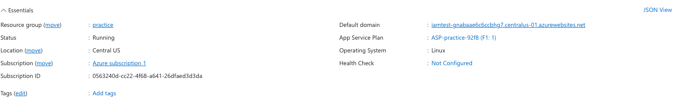

# Lab 01 – Identity & Access Control (Azure IAM)

## Goal
Show how identity misconfigurations in Azure can lead to excessive permissions, and how to fix them with least privilege.

## Steps

### 1. Deploy Web App
Deployed an Azure App Service (`iamdemoapp123`) with no database.  

### 2. Baseline – New User
Created **labuser@bricewoodardgmail.onmicrosoft.com** with no roles assigned.  

### 3. Misconfigured Permissions
Assigned **Owner** at the subscription level. Labuser could see and access resources.  

### 4. Fix – Least Privilege
Removed Owner and scoped **Storage Blob Data Reader** only to the `iamdemoaccount123` storage account.  

### 5. Validation
Tried listing blobs without permission → failed.  

Re-ran with correct role → success.  

---

## Key Takeaways
- Identity is the #1 attack vector in cloud security.  
- Subscription-level Owner = dangerous.  
- Always scope roles to the **smallest resource needed** (least privilege).  
- Validated principle of **deny by default → allow only what’s required**.
