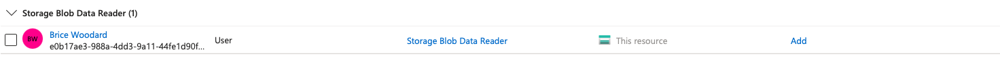
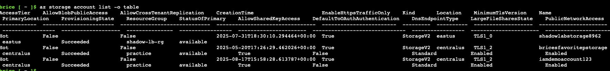
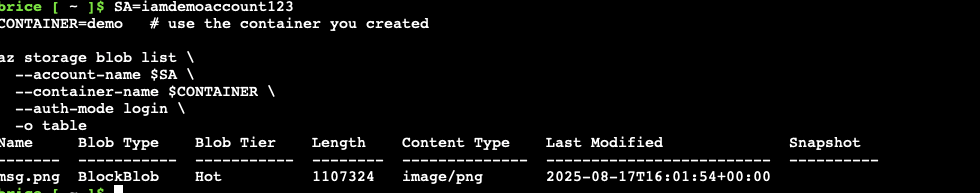

# Azure IAM Demo: Role-Based Access Control (RBAC)

This project demonstrates how Azure RBAC controls access to resources.  
We created a restricted user (`labuser`), then assigned and scoped roles to show how permissions change in real time.

---

## Steps & Screenshots

### 1. No Roles Assigned
`labuser` has no roles → cannot view or manage resources.  

### 2. Role Check (Before)
Attempting to list storage accounts fails.  

### 3. Role Scoped
Applying a scoped role assignment.  

### 4. Owner Success
With Owner assigned at subscription scope, `labuser` can now manage resources.  

### 5. List Denied
After restricting scope, `labuser` cannot list accounts.  

### 6. Blob Success
With correct scoped permissions, `labuser` can access blobs in the storage account.  

---

## Key Takeaways
- Azure RBAC lets you scope permissions from subscription → resource group → resource.  
- Missing or restricted roles cause **AuthorizationFailed** errors.  
- Scoped roles enforce least privilege, limiting actions to only what’s required.  
