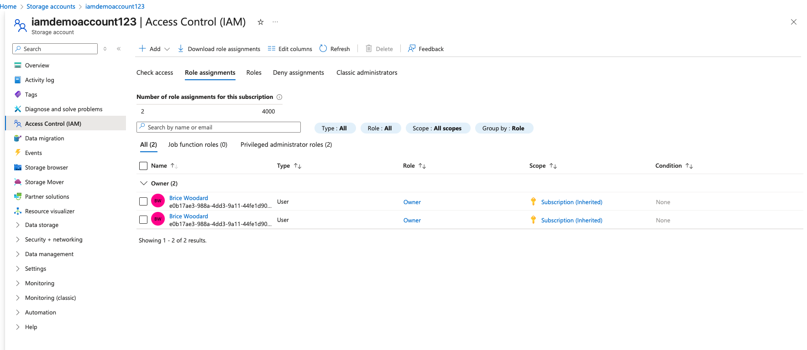
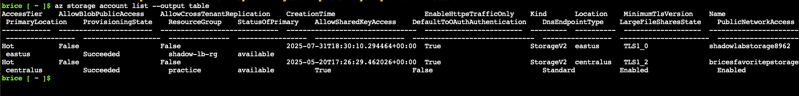
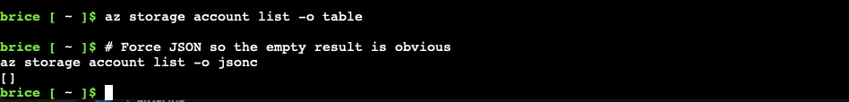

# Azure IAM Demo: Role-Based Access Control (RBAC)

This project demonstrates how Azure RBAC controls access to resources.  
We create a user (`labuser`), assign and remove roles, and observe how permissions affect actions.

---

## Steps & Screenshots

### 1. No Roles Assigned
User has no roles → cannot view or manage resources.


### 2. App Service Overview
Overview of the sample app deployed in Azure.


### 3. App Running
Confirm the app is deployed and accessible.


### 4. Role Assignment: Owner
Assigning the **Owner** role to the lab user.


### 5. Role Check (Before)
Listing storage accounts before scoped roles are applied.


### 6. Role Scoped
Applying a scoped role assignment.


### 7. Owner Success
Owner role now allows management operations.


### 8. List Denied
With restricted scope, listing accounts fails as expected.


### 9. Blob Success
With correct scoped permissions, blob operations succeed.


---

## Key Takeaways
- Azure RBAC lets you scope permissions from subscription → resource group → resource.
- Misconfigured or missing roles cause **AuthorizationFailed** errors.
- Scoped roles enforce least privilege, limiting actions to only what’s required.

---

## How to Reproduce
1. Create a new Azure AD user (`labuser`).
2. Deploy a test resource (App Service + Storage Account).
3. Assign/remove roles at subscription or resource level.
4. Verify access using Azure CLI commands:
   ```bash
   az login --username labuser@<yourtenant>.onmicrosoft.com
   az storage account list -o table
   az storage blob list --account-name iamdemoaccount123 --container-name <container>
